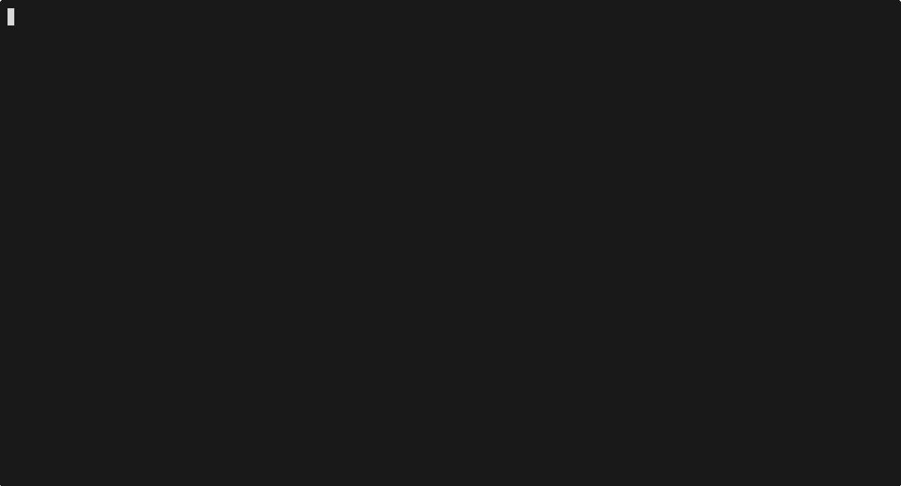

# How to run
get your anime list export at https://myanimelist.net/panel.php?go=export  
in completionist-cli.py add the path to:  
MAL_EXPORT_PATH = "YOUR_PATH"
 
 
 
python3 -m venv .venv 
source .venv/bin/activate 
pip install -r requirements.txt 
then run: 
python3 completionist-cli.py --help
 
 
 

# Examples

 
 

 
 

 
 
# Usage

 
